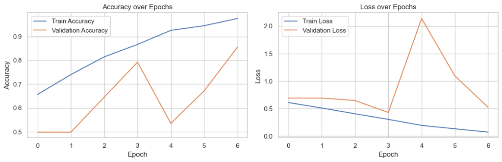
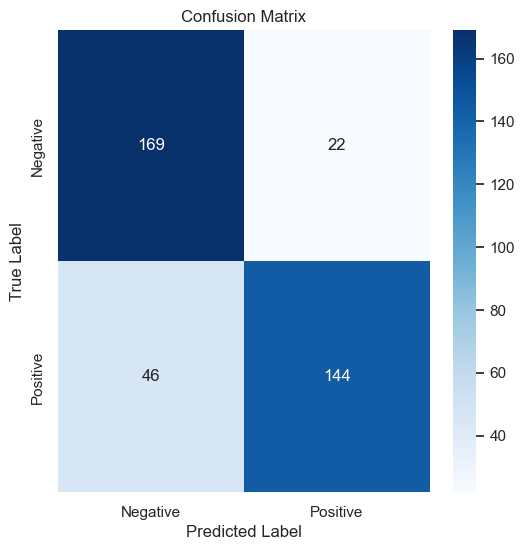
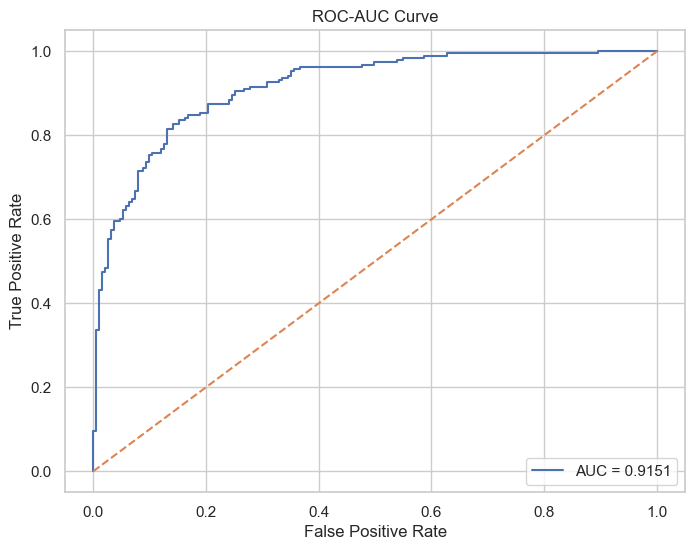
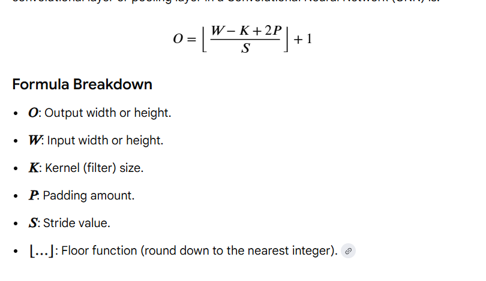
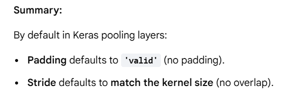

# Cancer_Detection_with_xai

Welcome to the **Cancer Detection with XAI** project! This repository contains a lightweight and efficient deep learning pipeline to detect cancer, specifically focusing on mobile/edge deployment and small datasets.

live link -  https://cancerdetectionwithxai.streamlit.app/

## Technologies & Libraries Used

### Core Deep Learning & Architecture
- **TensorFlow / Keras**: Core framework used to build, train, and serialize the deep learning models.
- **Fibonacci-Net**: The primary lightweight CNN architecture used for efficient feature extraction.

### Data Processing & Evaluation
- **NumPy**: Used for numerical computations and tensor manipulations (e.g., handling image batch dimensions).
- **Scikit-learn (sklearn)**: Used for computing essential evaluation metrics such as the Confusion Matrix and ROC-AUC scores.
- **Matplotlib**: Used for plotting training metrics (Accuracy/Loss curves), ROC-AUC curves, and visually appealing Confusion Matrices.
- **opencv-python-headless**: Used for robust image processing.
- **Pillow (PIL)**: Used for loading and manipulating images.
- **huggingface-hub**: Used for integrating with Hugging Face models and repositories.

### Frontend, Web Apps, & APIs
- **Streamlit**: Used to build a rapid, interactive web dashboard for real-time model inference and Explainable AI (XAI) visualizations.
- **FastAPI**: Used as the high-performance backend framework for serving the deep learning model predictions.
- **uvicorn**: An ASGI web server implementation used to serve the FastAPI backend.
- **python-multipart**: Used by FastAPI to parse form data and file uploads (vital for image endpoints).
- **Jinja2**: Used for rendering dynamic HTML templates.
- **HTML & CSS**: Used for structuring and styling the web interfaces.

### Document Automation & Logging
- **python-docx**: Used for generating dynamic, automated professional DOCX medical reports based on model predictions. (Key imports used: `Document`, `Inches`, `Pt`, `RGBColor`, `WD_ALIGN_PARAGRAPH`, `qn`, `OxmlElement`, `io`, `datetime`)
- **Logging Modules**: The project uses robust logging configured with `logging`, `logging.handlers.RotatingFileHandler`, `pathlib.Path`, `os`, and `uvicorn.config.LOG_LEVELS` to track model inference, API requests, and system events (`utils.logger.logger`).

---

## Fibonacci-Net Architecture

Fibonacci-Net is a lightweight CNN architecture designed for:
- Efficient feature extraction
- Low computational cost
- Mobile/edge AI deployment
- Medical imaging
- Small datasets

It combines:
- Fibonacci-based filter scaling
- Depthwise separable convolutions
- Residual/skip connections
- Avg-2Max pooling

### Architecture Diagram


### Additional Architecture Details


[View Further Architecture Details](https://ibb.co/N6gHZLv1)

*(Note: The [Excalidraw Link](https://link.excalidraw.com/p/readonly/nTbHqs6Z6NhUWvvaQ1Zq) provides a detailed depth-wise layer explanation).*

---

### 1. Fibonacci Convolution Arrangement (Fibonacci-based filters)

#### Idea
Instead of increasing filters aggressively like: `32 → 64 → 128`, Fibonacci-Net increases them using Fibonacci numbers: `21 → 34 → 55 → 89`.
The Fibonacci sequence: `1, 1, 2, 3, 5, 8, 13, 21, 34, 55, 89...`

#### What are filters?
Filters (kernels) in CNNs detect edges, textures, shapes, and patterns. More filters = more learning capacity.

#### Why use Fibonacci growth?
Traditional CNNs often consume large memory, use many parameters, and overfit on small datasets. Fibonacci scaling provides smoother growth.
**Benefits:**
- Fewer parameters
- Lower memory usage
- Lightweight architecture
- Gradual feature learning

#### Intuition
Instead of sudden complexity jumps, we use smoother growth. This improves efficiency and regularization.

---

### 2. Depthwise Separable Convolution
A lightweight alternative to standard convolution.

#### Standard Convolution
Normal CNN convolution processes all channels together. Example: RGB image → one filter operates on R, G, and B simultaneously. This is computationally expensive.

#### Depthwise Separable Convolution
It splits convolution into TWO operations:
1. **Step 1: Depthwise Convolution:** Each channel is processed independently (no channel mixing yet).
2. **Step 2: Pointwise Convolution:** A `1 × 1` convolution combines channel information (feature fusion).

#### Computational Efficiency
- **Standard convolution cost:** `K × K × M × N`
- **Depthwise separable convolution cost:** `K × K × M + M × N`
This drastically reduces computation.

**Benefits:**
- Faster training, reduced computation, fewer parameters, ideal for mobile and embedded AI. (Used in MobileNet, Xception).

---

### 3. Residual / Skip Connections
Inspired by ResNet.

#### Main Idea
Outputs from earlier layers are passed directly to deeper layers. Layer information skips intermediate layers.

#### Why is this important?
Deep networks suffer from vanishing gradients, feature degradation, and information loss. Skip connections help gradients flow easily.

#### Residual Learning
Instead of learning `H(x)`, the network learns `F(x) = H(x) - x`. Final output: `y = F(x) + x`. This simplifies optimization.

**Benefits:**
- Prevents vanishing gradients (stable deep learning).
- Preserves important features (earlier representations survive).
- Enables deeper CNNs.

---

### 4. Avg-2-Max Pooling
Combines Max Pooling and Average Pooling into a hybrid pooling strategy.

- **Max Pooling:** Selects the strongest activation. Good for edge detection/dominant features, but may lose smooth information.
- **Average Pooling:** Computes the average activation. Good for smooth textures/global context, but weak features may dominate.

#### Avg-2-Max Pooling Idea
`Output = Average Information + Max Information`
This captures sharp local features and smooth contextual features.

**Benefits:**
- Better feature extraction.
- Improved image understanding (useful for medical/texture datasets).
- Better edge-texture balance.

---

### Overall Flow of Fibonacci-Net
1. **Fibonacci Filter Arrangement:** Efficient feature scaling.
2. **Depthwise Separable Convolution:** Fast lightweight computation.
3. **Residual Connections:** Preserve information across layers.
4. **Avg-2-Max Pooling:** Capture both sharp and smooth features.

---

### Handling Class Imbalance
Fibonacci-Net is NOT explicitly designed for class imbalance, but several architectural components naturally help minority-class learning:

1. **Skip Connections / Parallel Concatenation (Strongest Effect):** Reuse shallow + deep features, preserve rare-class information.
2. **Avg-2Max Pooling:** Combines max (strong edges) and average (smooth features) pooling to preserve subtle textures.
3. **Fibonacci Filter Scaling:** Gradual scaling reduces overfitting, indirectly reducing bias toward majority classes.
4. **Depthwise Separable Convolution:** Smaller networks tend to overfit less.

#### Recommended Additions for Strong Imbalance
For highly imbalanced datasets, combine Fibonacci-Net with:
- Focal Loss
- Class-Weighted Cross Entropy
- Oversampling / Data Augmentation
- Balanced Batch Sampling
*(Use metrics like F1-score, Recall, ROC-AUC instead of accuracy alone)*

> **One-Line Summary:** Fibonacci-Net combines Fibonacci-based filter scaling, lightweight convolutions, residual learning, and hybrid pooling to build an efficient and compact CNN architecture.

---

## Image Preprocessing Short Notes

### 1. Model Input Shape
Deep learning models expect `(batch_size, height, width, channels)`. Example: `(1, 224, 224, 3)`.

### 2. `np.expand_dims(img_array, axis=0)`
Adds a new dimension at the beginning to create the batch dimension. Converts `(224,224,3)` to `(1,224,224,3)`.

### 3. `astype("float32")`
Converts datatype from `uint8` (0-255) to `float32` because it's faster, uses less memory, and is GPU optimized.

### 4. `/255.0`
Normalizes pixel values from `0 → 255` to `0.0 → 1.0` for faster convergence and stable gradients.

**Final Process:**
```python
img_array = np.expand_dims(img_array, axis=0)
img_array = img_array.astype("float32") / 255.0
```

---

## Learnings

### Productionizing Custom Layers
To make basic practice code with custom layers ready for production (and to be able to load a model containing custom layers), you should use the `@tf.keras.utils.register_keras_serializable()` decorator.

`@tf.keras.utils.register_keras_serializable()` is a decorator in TensorFlow / Keras used to make your custom layers, models, losses, metrics, or functions serializable. It helps TensorFlow save and load custom objects correctly without manually passing them in `custom_objects`.

**Important with `get_config()`:**
For proper saving/loading, custom classes should usually also define a `get_config` method:

```python
@tf.keras.utils.register_keras_serializable()
class MyCustomLayer(tf.keras.layers.Layer):
    def __init__(self, param, **kwargs):
        super().__init__(**kwargs)
        self.param = param
        
    def get_config(self):
        config = super().get_config()
        config.update({
            "param": self.param
        })
        return config
```

**Refactoring Prompt for AI Assistant:**
*If you need to refactor practice code into production code, you can use the following prompt:*
> "Refactor this code into production-level TensorFlow/Keras code with clean architecture, serialization support, comments, best practices, readability improvements, and proper OOP structure."

---

## Explainable AI (XAI)

### Grad-CAM
Grad-CAM (Gradient-weighted Class Activation Mapping) is an Explainable AI (XAI) technique used to visually interpret the decisions made by Convolutional Neural Networks (CNNs). It creates a heatmap highlighting the exact pixels or regions an AI focused on to classify an image.

---

## Model Training & Callbacks

### ReduceLROnPlateau vs. EarlyStopping

- **ReduceLROnPlateau**: This is a callback that reduces the learning rate when a monitored metric (like validation loss) has stopped improving. When the model reaches a plateau or gets stuck in a local minimum, lowering the learning rate allows it to take smaller steps and potentially find a better minimum, effectively *continuing* and fine-tuning the training.
- **EarlyStopping**: This callback stops the training process entirely when a monitored metric stops improving after a certain number of epochs (defined by `patience`). Its primary goal is to *halt* training to prevent the model from overfitting to the training data.

---

## Evaluation Metrics & Results

### 1. Accuracy and Loss over Epochs


### 2. Confusion Matrix


### 3. ROC-AUC Curve


---

## CNN Formulas & Keras Defaults

### Output Dimension Formula for Convolutional/Pooling Layers


The formula to calculate the output width or height (\(O\)) of a layer is:
\[ O = \lfloor \frac{W - K + 2P}{S} \rfloor + 1 \]

**Formula Breakdown:**
- **\(O\)**: Output width or height.
- **\(W\)**: Input width or height.
- **\(K\)**: Kernel (filter) size.
- **\(P\)**: Padding amount.
- **\(S\)**: Stride value.
- **\(\lfloor \dots \rfloor\)**: Floor function (round down to the nearest integer).

### Keras Pooling Layers Defaults


By default, in Keras pooling layers:
- **Padding** defaults to `'valid'` (no padding).
- **Stride** defaults to match the **kernel size** (no overlap).

---

## Appendix: Master Prompt — Dynamic AI Document Generator

*Note: The following prompt was used for generating automated professional human-readable reports dynamically.*

**PRIMARY OBJECTIVE:** Generate Python code that accepts dynamic input parameters, creates professional DOCX/PDF reports, uses modern formatting, produces enterprise-grade output using reusable modular functions, and is fully executable.

<details>
<summary>View the Full Prompt Requirements</summary>

**REQUIRED LIBRARIES:**
```python
from docx import Document
from docx.shared import Inches, Pt, RGBColor
from docx.enum.text import WD_ALIGN_PARAGRAPH
from docx.enum.section import WD_SECTION
from docx.enum.table import WD_TABLE_ALIGNMENT
from docx.oxml.ns import qn
from docx.oxml import OxmlElement

import io, os, datetime, textwrap, logging
```
*(Optional: pandas, numpy, matplotlib.pyplot, PIL.Image, reportlab)*

**CODE ARCHITECTURE REQUIREMENTS:**
```python
def generate_report(title, patient_name, report_type, summary, findings, confidence_score, table_data=None, image_paths=None, output_path="output.docx"):
```
The code MUST:
1. Be production-ready
2. Save output automatically
3. Avoid hardcoded values
4. Return ONLY valid Python code (No markdown, no commentary, no pseudo-code).
</details>


Here's the complete flow of your FastAPI routes:

# Application Startup

```text
Server Starts
      │
      ▼
startup_event()
      │
      ▼
load_model()
      │
      ├── Download model from HuggingFace
      ├── Load TensorFlow model
      └── Store in global MODEL
```

---

# Route 1: GET /

```text
Browser opens website
         │
         ▼
GET /
         │
         ▼
read_root()
         │
         ▼
Return index.html
         │
         ▼
Frontend Page Displayed
```

---

# Route 2: POST /analyze

```text
User Uploads Thyroid Image
           │
           ▼
POST /analyze
           │
           ▼
analyze()
           │
           ▼
Check MODEL loaded?
           │
     ┌─────┴─────┐
     │           │
    YES         NO
     │           │
     │      load_model()
     │           │
     │      Success?
     │           │
     │      ┌────┴────┐
     │      │         │
     │     YES       NO
     │      │         │
     │      │      Return 503
     │      │
     ▼      ▼

Read Uploaded File
           │
           ▼
contents = await file.read()
           │
           ▼
Convert Bytes → PIL Image
           │
           ▼
Image.open(BytesIO(contents))
           │
           ▼
preprocess_image(image)
           │
           ▼
processed_img
           │
           ▼
MODEL.predict(processed_img)
           │
           ▼
Prediction Score
           │
           ▼
score = preds[0][0]
           │
           ▼
score > 0.5 ?
      ┌────┴────┐
      │         │
    True      False
      │         │
      ▼         ▼
Malignant    Benign
```

### Grad-CAM Flow

```text
Find Last Conv Layer
          │
          ▼
make_gradcam_heatmap()
          │
          ▼
Heatmap Generated
          │
          ▼
save_and_display_gradcam()
          │
          ▼
Overlay Heatmap on Image
          │
          ▼
Convert to Base64
```

### Final Response

```text
Return JSON

{
  label,
  score,
  percent,
  class_id,
  is_malignant,
  original_image,
  gradcam_image
}
```

---

# Route 3: POST /report

```text
User Clicks Download Report
           │
           ▼
POST /report
           │
           ▼
get_report()
           │
           ▼
Check MODEL Loaded
           │
           ▼
Read Uploaded Image
           │
           ▼
preprocess_image()
           │
           ▼
MODEL.predict()
           │
           ▼
Get Score
           │
           ▼
Determine Label
           │
           ▼
Malignant / Benign
```

### Generate Grad-CAM Again

```text
Find Last Conv Layer
          │
          ▼
Generate Heatmap
          │
          ▼
Overlay on Image
          │
          ▼
Save Into BytesIO
```

### Prepare Original Image

```text
Original PIL Image
        │
        ▼
Save Into BytesIO
```

### Create DOCX Report

```text
generate_docx_report(
    image,
    prediction,
    confidence,
    gradcam
)
        │
        ▼
DOCX Buffer Created
```

### Send File To User

```text
DOCX Buffer
      │
      ▼
StreamingResponse
      │
      ▼
Browser Download

thyroid_analysis_report.docx
```

---

# Full System Flow

```text
                 Application Start
                         │
                         ▼
                 Load AI Model
                         │
         ┌───────────────┴───────────────┐
         │                               │
         ▼                               ▼

      GET /                         POST /analyze
         │                               │
         ▼                               ▼
    index.html                 Upload Thyroid Image
                                         │
                                         ▼
                                 Preprocess Image
                                         │
                                         ▼
                                  AI Prediction
                                         │
                                         ▼
                                  Generate GradCAM
                                         │
                                         ▼
                                 Return JSON Result
                                         │
                                         ▼
                             User Clicks Download Report
                                         │
                                         ▼
                                   POST /report
                                         │
                                         ▼
                              Predict + GradCAM Again
                                         │
                                         ▼
                                Generate DOCX Report
                                         │
                                         ▼
                             StreamingResponse(.docx)
                                         │
                                         ▼
                                Report Downloaded
```

One thing to notice: **`/report` repeats almost all the work done in `/analyze`** (prediction + Grad-CAM). In production, many developers would save the analysis result from `/analyze` and reuse it in `/report` instead of recomputing everything. This is one of the first optimizations I'd suggest for this code.
